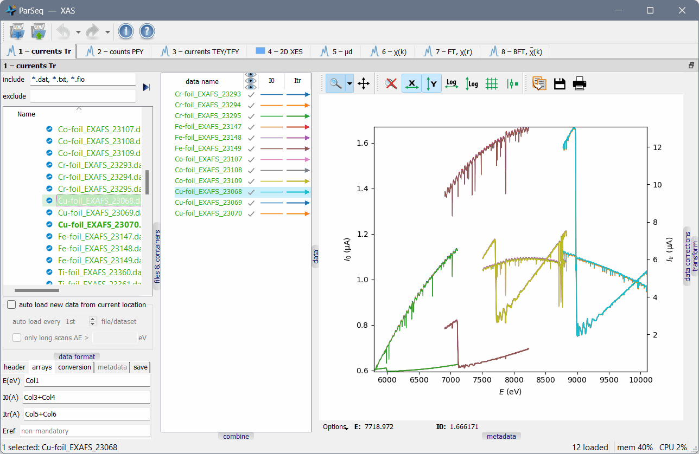

ParSeq
======

Package ParSeq is a python software library for <ins>Par</ins>allel execution
of <ins>Seq</ins>uential data analysis. It implements a general analysis
framework that consists of transformation nodes -- intermediate stops along the
data pipeline to visualize data, display status and provide user input -- and
transformations that connect the nodes. It provides an adjustable data model
(supports grouping, renaming, moving and drag-and-drop), tunable data format
definitions, plotters for 1D, 2D and 3D data, cross-data analysis routines and
flexible widget work space suitable for single- and multi-screen computers. It
also defines a structure to implement particular analysis pipelines as
relatively lightweight Python packages.

ParSeq is intended for synchrotron based techniques, first of all spectroscopy.

A screenshot of ParSeq-XAS (an EXAFS analysis pipeline) as an application
example:

  

Main features
-------------

-  ParSeq allows creating analysis pipelines as lightweight modules.

-  Flexible use of screen area by detachable/dockable transformation nodes
   (parts of analysis pipeline).

-  Two ways of acting from GUI onto multiple data: (a) simultaneous work with
   multiply selected data and (b) copying a specific parameter or a group of
   parameters from active data items to later selected data items.

-  Undo and redo for most of treatment steps.

-  Entering into the analysis pipeline at any node, not only at the head of the
   pipeline.

-  Creation of cross-data combinations (e.g. averaging, RMS or PCA) and their
   propagation downstream the pipeline together with the parental data. The
   possibility of termination of the parental data at any selected downstream
   node.

-  Parallel execution of data analysis with multiprocessing or multithreading
   (can be opted by the pipeline application).

-  Optional curve fitting solvers, also executed in parallel for multiple data
   items.

-  Informative error handling that provides alerts and stack traceback -- the
   type and location of the occurred error.

-  Export of the workflow into a project file. Export of data into various data
   formats with accompanied Python scripts that visualize the exported data for
   the user to tune their publication plots.

-  ParSeq understands container files (presently only hdf5) and adds them to
   the system file tree as subfolders. The file tree, including hdf5
   containers, is lazy loaded thus enabling big data collections.

-  A web viewer widget near each analysis widget displays help pages generated
   from the analysis widget doc strings. The help pages are built by Sphinx at
   the startup time.

-  The pipeline can be operated via scripts or GUI.

-  Optional automatic loading of new data during a measurement time.

The mechanisms for creating nodes and transformations, connecting them together
and creating Qt widgets for the transformations are exemplified by separately
installed analysis packages:

- [ParSeq-XES-scan](https://github.com/kklmn/ParSeq-XES-scan)
- [ParSeq-XES-dispersive](https://github.com/kklmn/ParSeq-XES-dispersive)
- [ParSeq-XAS](https://github.com/kklmn/ParSeq-XAS)

Dependencies
------------

- [silx](https://github.com/silx-kit/silx) -- for plotting and Qt imports,
- [sphinx](https://github.com/sphinx-doc/sphinx) -- for building html documentation.

Launch an example
-----------------

Either install ParSeq and a ParSeq pipeline application by their installers to
the standard location or put them to any folder in their respective folders
(``parseq`` and e.g. ``parseq_XES_scan``) and run the ``*_start.py`` module of
the pipeline. You can try it with ``--help`` to explore the available options.
An assumed usage pattern is to load a project ``.pspj`` file from GUI or from
the starting command line.

Documentation
-------------

See the documentation inside ParSeq or at https://parseq.readthedocs.io 

