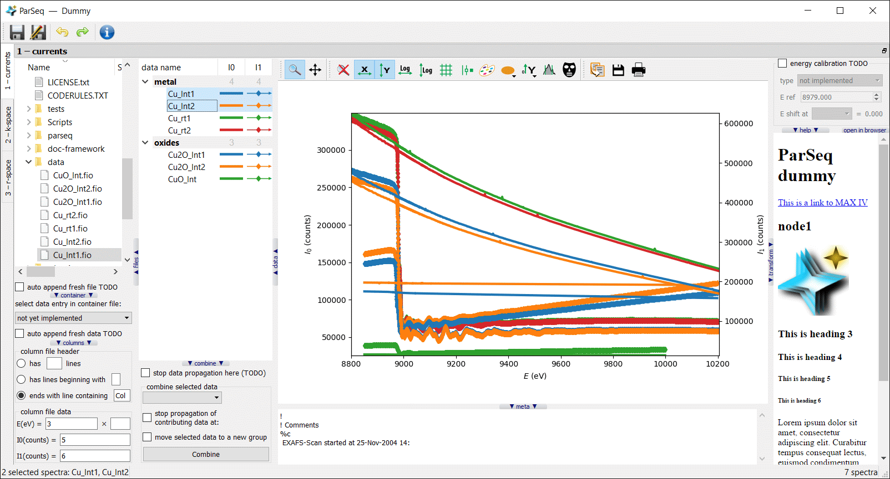

ParSeq
======

ParSeq is a python software library for Parallel execution of Sequential data
analysis. It implements a general analysis framework with a data model,
plotter, cross-data analysis and tunable widget work space. It also gives a
structure to implement particular analysis pipelines as relatively lightweight
Python packages.

ParSeq is intended for synchrotron based techniques, first of all spectroscopy.

It is in development state, not yet ready for general users.

A screenshot of the Dummy analysis pipeline serving as an application example:

  

Main features
-------------

- Efficient use of screen area by detachable transformation nodes (parts of
  analysis pipeline).

- Two ways of acting from GUI onto multiple data: (a) simultaneous work with
  multiply selected data and (b) application of a specific parameter to later
  selected data (TODO).

- Undo and redo for all treatment steps.

- Entering into the analysis pipeline at any node, not only at the head of the
  pipeline.

- Creation of cross-data combinations (e.g. averaging, RMS or PCA) and their
  propagation downstream the pipeline together with the parental data. The
  possibility of termination of the parental data at any selected downstream
  node.

- Parallel execution of data analysis on GPU (TODO).

ParSeq creates a data analysis pipeline consisting of nodes and transforms
which connect the nodes. The pipeline is fed with data (spectra), possibly
entering the pipeline at various nodes. The pipeline can be operated via
scripts or GUI. The mechanisms for creating nodes and transforms and connecting
them together are exemplified by the sub-package `parseq/apps/dummy` (a simple
pipeline).

Dependencies
------------

silx -- is used for plotting and Qt imports.

How to test
-----------

Run `tests\test_mainWindow.py`. It loads a few EXAFS spectra located in `data`.
Tested on Windows (10), Linux (Ubuntu 18.10 and Kubuntu 18.04) and macOS
(10.13), with Python 2 and 3, PyQt4 and PyQt5, `matplotlib` and `opengl`
backends of silx plotter (both have some issues).
The folder `tests` has other scripts for testing various parts of ParSeq.
