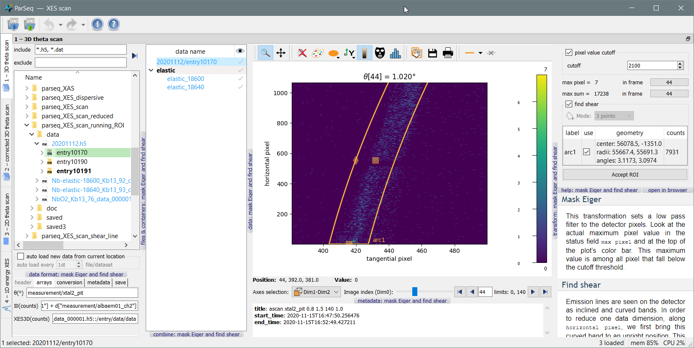

ParSeq
======

Package ParSeq is a python software library for <ins>Par</ins>allel execution
of <ins>Seq</ins>uential data analysis. It implements a general analysis
framework with an adjustable data model (supports grouping, renaming, moving
and drag-and-drop), plotters for 1D, 2D and 3D data, cross-data analysis
routines and flexible widget work space suitable for single- and multi-screen
computers. It also gives a structure to implement particular analysis pipelines
as relatively lightweight Python packages.

ParSeq is intended for synchrotron based techniques, first of all spectroscopy.

A screenshot of a scanning XES analysis pipeline as an application example:

  

Main features
-------------

-  ParSeq allows creating analysis pipelines as lightweight modules. The above
   example (scanning XES) is ~1000 lines with ~50% of them defining the four
   analysis widgets.

-  Flexible use of screen area by detachable/dockable transformation nodes
   (parts of analysis pipeline).

-  Two ways of acting from GUI onto multiple data: (a) simultaneous work with
   multiply selected data and (b) applying a specific parameter or a group of
   parameters to a later selected subset of data.

-  Undo and redo for most of treatment steps.

-  Entering into the analysis pipeline at any node, not only at the head of the
   pipeline.

-  Creation of cross-data combinations (e.g. averaging, RMS or PCA) and their
   propagation downstream the pipeline together with the parental data. The
   possibility of termination of the parental data at any selected downstream
   node.

-  Parallel execution of data analysis with multiprocessing or multithreading
   (can be opted by the piplene application).

-  Export of the workflow into a project file. Export of data into various data
   formats (so far unstructured) with accompanied Python scripts that visualize
   the exported data for the user to tune their publication plots.

-  ParSeq understands container files (presently only hdf5) and adds them to
   the system file tree as subfolders. The file tree, including hdf5
   containers, is lazy loaded thus enabling big data collections.

-  A web viewer widget near each analysis widget for displaying help pages
   built from doc strings. The help pages are built by Sphinx at the startup
   time.

ParSeq creates a data analysis pipeline consisting of nodes and transformations
that connect the nodes. The pipeline is fed with data (spectra or images),
possibly entering the pipeline at various nodes. The pipeline can be operated
via scripts or GUI. The mechanisms for creating nodes and transformations,
connecting them together and creating Qt widgets for the transformations are
exemplified by separately installed analysis packages:

- [ParSeq-XES-scan](https://github.com/kklmn/ParSeq-XES-scan)
- [ParSeq-XES-dispersive](https://github.com/kklmn/ParSeq-XES-dispersive)

Dependencies
------------

- [silx](https://github.com/silx-kit/silx) -- is used for plotting and Qt imports.
- [sphinx](https://github.com/sphinx-doc/sphinx) -- for building html documentation.

Launch an example
-----------------

Either install ParSeq and a ParSeq pipeline application by their installers to
the standard location or put their main folders to any folder and start the
``*_start.py`` file of the pipeline. You can try it with ``--test`` to load
test data and/or ``--noGUI`` to run the pipeline fully in the terminal and plot
only the end results but an assumed pattern is to load a project ``.pspj`` file
from GUI.

Documentation
-------------

See the documentation inside ParSeq or at http://parseq.readthedocs.io 

