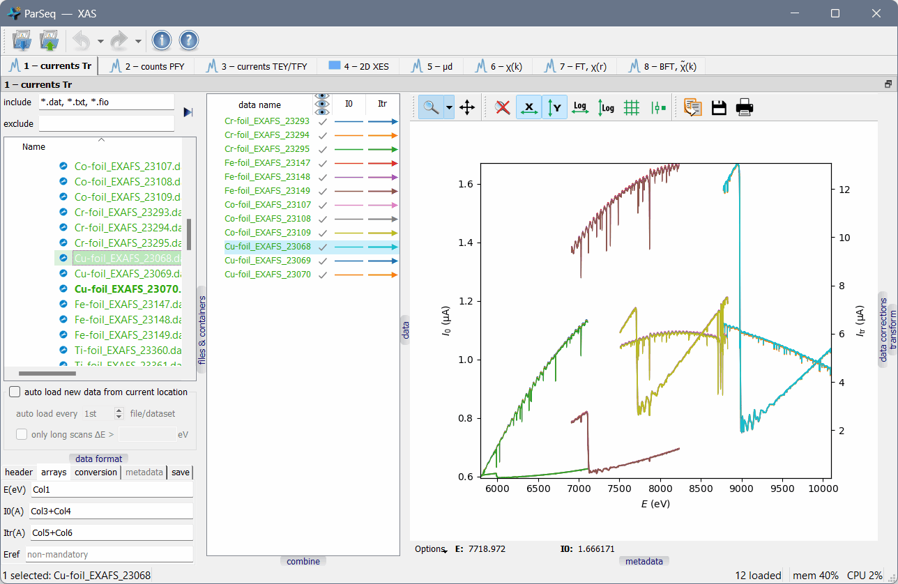

ParSeq
======

Package ParSeq is a python software library for <ins>Par</ins>allel execution
of <ins>Seq</ins>uential data analysis workflows. It implements a general
analysis framework built around transformation nodes -- intermediate steps in a
data pipeline used for visualization, cross-data operations (e.g., averaging),
user interaction and status reporting -- and the transformations that connect
these nodes.

ParSeq provides an adjustable data tree model that supports grouping, renaming,
moving and drag-and-drop arrangement of datasets. It also includes customizable
data format definitions, plotting tools for 1D, 2D, and 3D data, cross-data
analysis routines and a flexible widget workspace suitable for both single- and
multi-screen environments. ParSeq defines a structure for implementing specific
analysis pipelines as lightweight Python packages.

ParSeq is primarily designed for synchrotron-based techniques, with a
particular emphasis on spectroscopy.

An example application is ParSeq-XAS, an EXAFS analysis pipeline, shown in the
screenshot below:

  

Main features
-------------

-  ParSeq enables the creation of analysis pipelines as lightweight Python
   packages.

-  Flexible use of screen space through detachable and dockable transformation
   nodes (components of the analysis pipeline).

-  Two modes of applying GUI actions to multiple datasets:
   (a) simultaneous operations on multiple selected datasets, and
   (b) copying individual parameters or parameter groups from active datasets
       to subsequently selected datasets.

-  Undo and redo support for most data processing steps.

-  Ability to enter the analysis pipeline at any node, not only at its starting
   point.

-  Creation of cross-data combinations (including average, sum, RMS, classical
   PCA, cumulative PCA, Target Transformation and MCR-ALS), with downstream
   propagation alongside the parent data. Parent datasets can optionally be
   terminated at any selected downstream node.

-  General data correction routines for 1D data, including range deletion,
   scaling, spline replacement, spike removal, and jump correction.

-  Parallel execution of data transformations using either multiprocessing or
   multithreading (configurable by the pipeline application).

-  Optional curve-fitting solvers, also supporting parallel execution across
   multiple datasets.

-  Informative error handling, providing alerts and stack traceback with the
   type and location of errors.

-  Optional time profiling of the pipeline, controllable via a command-line
   option.

-  Export of workflows to project files, as well as data export to various
   formats, accompanied by Python scripts that visualize the exported data in
   publication-quality plots.

-  Support for container files (currently HDF5), which are represented as
   subfolders within the system file tree. The file tree, including containers,
   is lazy-loaded to efficiently handle large datasets.

-  Integrated web viewer widget for each analysis node, displaying help pages
   automatically generated from docstrings using Sphinx at startup.

-  The pipeline can be executed either through the GUI or via Python scripts
   (headless operation).

-  Optional automatic loading of new data during ongoing measurements.

The mechanisms for creating nodes, transformations, and curve-fitting solvers,
as well as for connecting them and developing Qt widgets for transformations
and curve fitting, are demonstrated in separately distributed packages:

- [ParSeq-XES-scan](https://github.com/kklmn/ParSeq-XES-scan)
- [ParSeq-XAS](https://github.com/kklmn/ParSeq-XAS)

Running without installation
----------------------------

Download the ZIP archives of ParSeq and a ParSeq pipeline from GitHub. Extract
their contents (e.g., `parseq` and `parseq_XES_scan` folders) into the same
suitable directory. Install the
[dependencies] (https://parseq.readthedocs.io/instructions.html), then run the
pipeline starter.

One advantage of this approach is that a single ParSeq installation can be
shared across multiple Python environments.

Running with installation
-------------------------

a) Install py `pip`: ``pip install parseq`` and e.g. ``pip install parseq-XAS``.
b) Alternatively, install from unzipped GitHub sources. Navigate to the
   directories containing pyproject.toml and run: ``python -m pip install .``.

After installation, pipeline starters can be executed directly from the command
line, for example: ``parseq-XAS``.

Launch an example
-----------------

Run the `*_start.py` module of a pipeline. If ParSeq and the corresponding
pipeline are installed (rather than simply unpacked), these starters are also
available as command-line commands.

You can invoke them with the ``--help`` option to explore the available
parameters. A common usage pattern is to load a project (.pspj) file either
from the GUI or directly via the command line at startup.

Documentation
-------------

See the documentation inside ParSeq or on https://parseq.readthedocs.io

